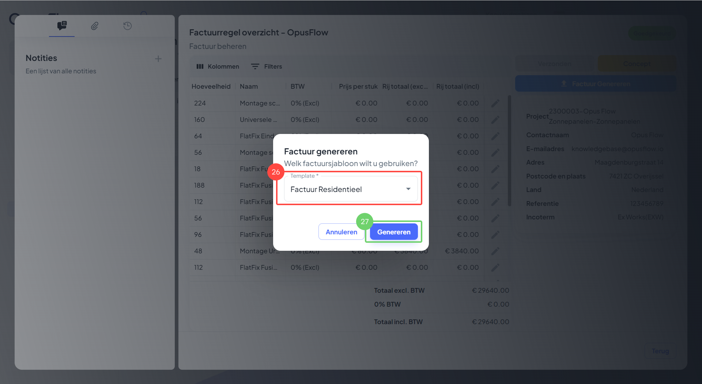
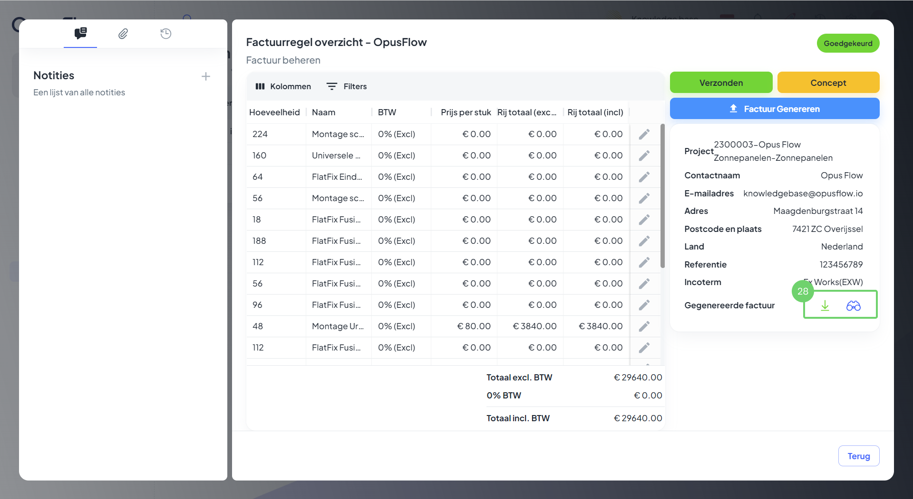

# Factuur aanmaken

### 1. Het contact openen

<figure><figcaption></figcaption></figure>

Uitleg

1. Ga naar de menubalk, navigeer naar "CRM" open hier de "Contacten".&#x20;
2. Selecteer de gewenste klant waarvoor je een factuur wilt maken.&#x20;

### 2. Een entiteit koppelen

<figure><figcaption></figcaption></figure>

Uitleg

3. Ga naar het tabblad "Administratie".
4. Link hier de "Entiteit", op dit moment is er geen entiteit gekoppeld.
5. Maak hier de een "Koppeling".

### 3. Een entiteit aanmaken

<figure><figcaption></figcaption></figure>

Uitleg

6. Vul hier de benodigde gegevens in.
7. Druk op "Aanmaken".

### 4. Offertes en facturen overzien

<figure><figcaption></figcaption></figure>

Uitleg 

8. Hier zie je de offertes welke van toepassing zijn op de klant.
9. Hier zie je de facturen welke van toepassing zijn op de klant.
10. Ga naar de menubalk, navigeer naar "Administratie".&#x20;

### 5. Een factuur maken

<figure><figcaption></figcaption></figure>

Uitleg

11. Navigeer naar "Facturen" om naar het overzicht van facturen te gaan.
12. Druk op "Factuur Aanmaken" om een nieuwe factuur aan te maken.

### 6. Factuur gegevens ingeven

<figure><figcaption></figcaption></figure>

Uitleg

13. Selecteer hier de entiteit voor de factuur.
14. Selecteer hier het factuur sjabloon.
15. Selecteer hier het project welke je wilt factureren.
16. Hier kun je een bestaande offerte omzetten naar een factuur. &#x20;
17. Druk op "Aanmaken"

### 7.  De concept factuur opstellen

<figure><figcaption></figcaption></figure>

Uitleg

18. Hier zie je hoe de factuur is opgebouwd, de artikelen en kosten.
19. Hier zie je de totaalprijzen en BTW.
20. &#x20;Hier zie je de algemene project informatie.
21. Hier kun je eventueel nog artikelen toevoegen aan de factuur.
22. &#x20;Hier zie je de huidige status van de factuur.
23. &#x20;Druk op "Concept afronden" om het concept af te ronden.

### 8. Goedkeuren of Weigeren

<figure><figcaption></figcaption></figure>

Uitleg

24. &#x20;Hier kun je het concept goedkeuren of weigeren.&#x20;

### 9. Factuur genereren.

<figure><figcaption></figcaption></figure>

Uitleg

25. Druk op "Factuur Genereren" om de factuur te genereren.

### 10. Kies het template

<figure><figcaption></figcaption></figure>

Uitleg

26. &#x20;Kies het gewenste template.
27. &#x20;Om de factuur te genereren druk je op "Genereren".

### 11. Factuur downloaden of bekijken

<figure><figcaption></figcaption></figure>

Uitleg

28. &#x20;De factuur kun je downloden of inzien door op de bijbehorende icoon te drukken.

