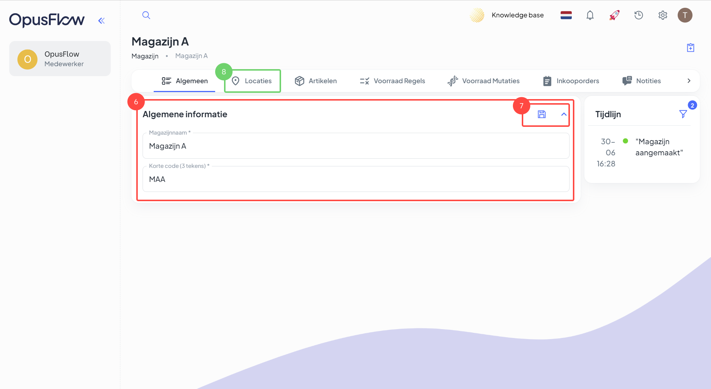

# Magazijn organiseren

### 1. Het overzicht van de magazijnen

<figure><figcaption></figcaption></figure>

Uitleg 

1. Ga naar de menubalk, navigeer naar "Voorraad"  en druk op "Magazijnen".
2. Druk op "+ Nieuw" om een nieuw magazijn aan te maken.

### 2. Nieuw magazijn toevoegen

<figure><figcaption></figcaption></figure>

Uitleg

3. Geef het nieuw magazijn een naam.
4. Druk op "Aanmaken" om het nieuwe magazijn aan te maken.

### 3. Het magazijn openen

<figure><figcaption></figcaption></figure>

Uitleg

5. Druk op de naam van het magazijn om het magazijn te openen.

### 4. Algemene informatie van het magazijn

<figure><figcaption></figcaption></figure>

Uitleg

6. Hier zie je de algemene informatie van het magazijn, je kunt hier de magazijnnaam en de korte code van het magazijn aanpassen.
7. Sla de wijzigingen op.
8. Druk op "Locaties" om de (sub)locaties te beheren.

### 5. Een nieuwe sublocatie aanmaken

<figure><figcaption></figcaption></figure>

Uitleg

9. Druk op de aanmaak knop om een nieuwe locatie aan te maken.

### 6. Geef de locatie een naam

<figure><figcaption></figcaption></figure>

Uitleg

10. Geef de locatie een naam.
11. Druk op "Aanmaken" om het nieuwe magazijn aan te maken.

### 7. Het overzicht van artikelen

<figure><figcaption></figcaption></figure>

Uitleg

12. In dit menu kun je de verschillende overzichten en beheermogelijkheden openen van het geopende magazijn.
13. Onder de tab "Artikelen" zie je de voorraad per artikel in dat zich in het magazijn bevindt.
14. Door op "+" te drukken kun je een nieuw mutatie aanmaken. Hiermee kun je inkomende mutatie, uitgaande mutatie of een correctie registeren. Lees meer in het volgende artikel [mutaties-aanmaken-van-bom-tot-uitvoering.md](mutaties-aanmaken-van-bom-tot-uitvoering.md "mention").

### 8. Voorraad Regels aanmaken

<figure><figcaption></figcaption></figure>

Uitleg

15. Druk op "Voorraad Regels" om het overzicht van voorraad regels te openen.
16. Druk op "+" om een nieuw voorraad regel aan te maken.

### 9. Een nieuw voorraadregel

<figure><figcaption></figcaption></figure>

Uitleg

17. Geef aan om welk artikel het gaat.&#x20;
    * **Minimale voorraad:** Dit is de minimale voorraad welke je van dit artikel altijd in het magazijn wilt hebben liggen.
    * **Maximale voorraad:** Dit is de maximale voorraad welke je van dit artikel in het magazijn wilt hebben liggen.
    * **Voorraad drempel:** Dit is de drempelwaarde waarbij je wil dat er actie ondernomen wordt. Zoals het bestellen van nieuwe artikelen.&#x20;

