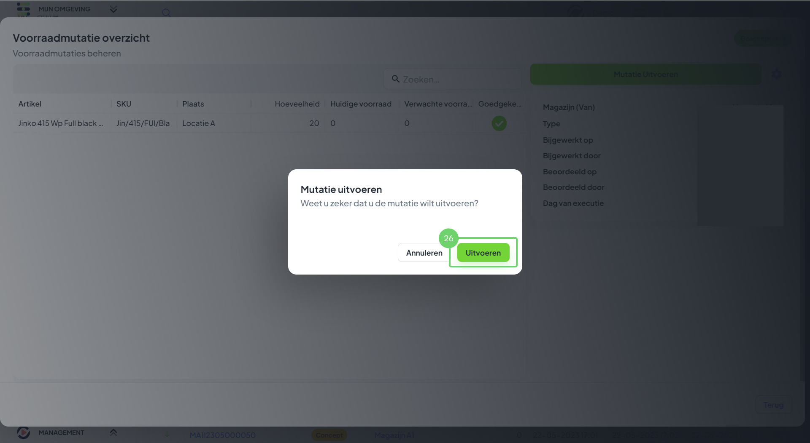

# Voorraadcontroles doorvoeren

### 1. Het mutatie overzicht

<figure><figcaption></figcaption></figure>

Uitleg

1. Ga naar de menubalk, navigeer naar "Voorraad" en druk op "Mutaties".
2. Druk op "Voorraadmutatie Maken" om een nieuwe mutatie te maken.

### 2. Een nieuwe mutatie maken

<figure><figcaption></figcaption></figure>

Uitleg

3. Hier vul je de gegevens in van de nieuwe mutatie.

### 3. Mutatie type instellen

<figure><figcaption></figcaption></figure>

Uitleg

4. Voer hier het mutatie type "Voorraadcontrole" in.&#x20;

### 4. Kies het doel magazijn

<figure><figcaption></figcaption></figure>

Uitleg

5. Kies het magazijn welke het doel is van de voorraadcontrole, het magazijn waarop je de mutatie wilt uitvoeren.
6. Laat deze instelling op "Geen" staan, aangezien je geen voorraad wilt verplaatsen.

### 5. Het mutatieoverzicht

<figure><figcaption></figcaption></figure>

Uitleg

8. Hier zie je de details van de mutatie.
9. Hier kun je de artikelen opzoeken waarvan je de hoeveelheid wilt aanpassen in het magazijn.
10. Hier zie je de status van de mutatie, op dit moment is het een "Concept".

### 6. Het concept afronden

<figure><figcaption></figcaption></figure>

Uitleg

11. Nadat je alle artikelen hebt toegevoegd zie je hier de lijst met mutatieregels.
12. Druk op "Concept Afronden" om het concept af te ronden.

### 7. Bevestig de afronding

<figure><figcaption></figcaption></figure>

Uitleg

13. Bevestig de afronding van de mutatie.
14. Druk op "Opslaan" om het concept op te slaan.

### 8. Voorraadcontroleregels selecteren.

<figure><figcaption></figcaption></figure>

Uitleg 

15. Selecteer een artikel om deze te beoordelen. Druk op "Bulk" en kies voor goedkeuren, afwijzen of verwijderen.
16. Hier zie je de huidige status van de mutatie, de mutatie is "in afwachting" van goedkeuring.

### 9. Mutatieregel goedkeuren

<figure><figcaption></figcaption></figure>

Uitleg

17. Bij het goedkeuren / afwijzen van de mutatieregels kun je nog een beoordelingsomschrijving achterlaten.
18. Kies "Goedkeuren" of "Afwijzen".

### 10. Mutatie accepteren

<figure><figcaption></figcaption></figure>

Uitleg

19. Hier zie je de artikelen, aan het groene vinkje achter het artikel zie je dat het artikel is goedgekeurd.
20. &#x20;Hier zie je de huidige status van de mutatie, deze is "in afwachting" van goedkeuring.
21. &#x20;Druk op "Accepteer Mutatie" om de mutatie te accepteren.

### 11. Acceptatie bevestigen

<figure><figcaption></figcaption></figure>

Uitleg

22. &#x20;Hier heb je de mogelijkheid om nog een omschrijving met de acceptatie mee te geven.
23. &#x20;Druk op "Aanvaarden" om de acceptatie van de mutatie te aanvaarden.

### 12. Mutatie uitvoeren

<figure><figcaption></figcaption></figure>

Uitleg

24. &#x20;Hier zie je de status van de mutatie, deze is geaccepteerd.
25. &#x20;Druk op "Mutatie uitvoeren" om de mutatie uit te voeren.

### 13. Bevestig de uitvoering

<figure><figcaption></figcaption></figure>

Uitleg

26. &#x20;Bevestig door te drukken op "Uitvoeren", hierdoor worden de wijzingen aangebracht in het magazijn.

