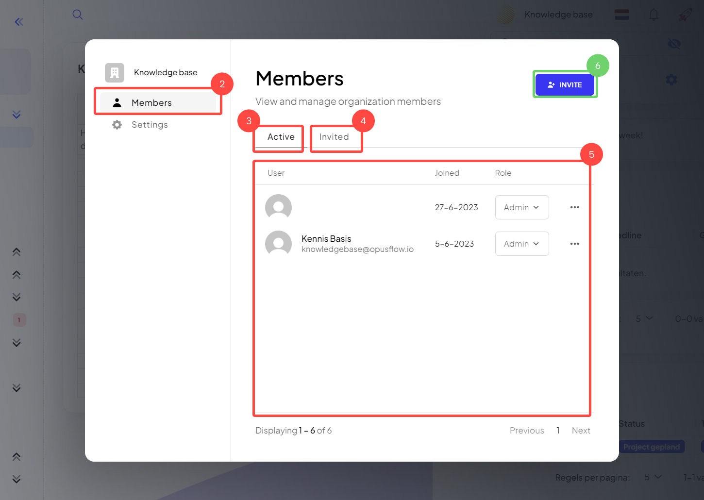
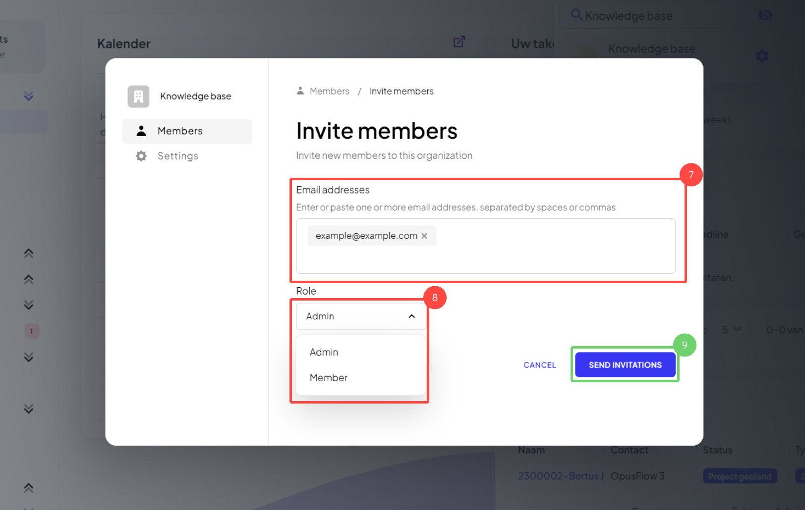

# Nieuwe gebruikers toevoegen

### 1. Ga naar instellingen

<figure><figcaption></figcaption></figure>

Uitleg

1. Open instellingen door op je eigen bedrijfsnaam en dan op het tandwiel te drukken.

### 2. Huidige gebruikers bekijken

<figure><figcaption></figcaption></figure>

Uitleg

2. Ga naar "Members" (leden) om de huidige gebruikers te zien.
3. In het tabblad "Active" zie je alle actieve gebruikers, gebruikers welke de uitnodiging ooit hebben goedgekeurd.
4. In het tabblad "Invited" zie je alle uitgenodigde gebruikers, deze gebruikers hebben een uitnodiging ontvangen maar deze tot op heden niet geaccepteerd.
5. Hier zie je de gebruikers en hun rol.
   * **Role Admin:** Een admin is een gebruiker die alle rechten heeft, deze gebruiker kan alles zien en alles veranderen.
   * **Role Member:** Een member is een gebruiker die slechts een eigen selectie aan rollen heeft, deze gebruiker kan alleen zien waar hij/ zij toestemming voor heeft.
6. Een nieuwe gebruiker kun je toevoegen door op "Invite" te drukken.&#x20;

### 3. Nieuwe gebruikers toevoegen

<figure><figcaption></figcaption></figure>

Uitleg

7. Hier kun je de emailadressen in typen van en nieuwe gebruikers uitnodigen.&#x20;
8. Maak een keuze tussen "Admin" of "Member".
9. Druk op "Send invitations" om de gebruikers uit te nodigen.

