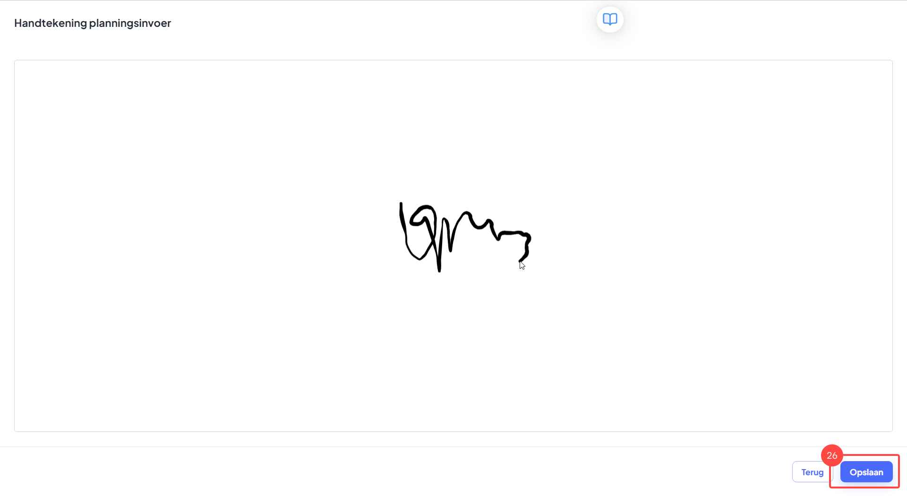

# Werknemers inplannen

### 1. Open de planner

<figure><figcaption></figcaption></figure>

Uitleg

1. Ga naar de menubalk, navigeer naar "Planning" ga binnen de module naar "Planner".
2. Hier zie je al je collega's. Het is mogelijk om zowel mensen individueel als per team in te plannen. Op het moment zijn er geen teams aangemaakt en zien we alle collega's individueel.
3. Je kan verschillende tijdslijnen selecteren: dag, week of maand.
4. Hier kan je wisselen tussen de verschillende dagen, weken of maanden afhankelijk van de tijdlijn die je geselecteerd hebt.&#x20;
5. Als je op "Vandaag" drukt dan zal je automatisch terug gaan naar het overzicht van vandaag.
6. Als je op een collega wil inplannen(individueel niveau), dan kan je dit doen door op de lijn van deze collega tussen de geselecteerde tijden met de muis te slepen. Als je dit doet dan opent het inplanoverzicht.
7. Als je een project wil inplannen (team niveau) en wilt kijken welke collega's je hiervoor wil inzetten dan kan je dit doen door boven alle collega's met je muis te slepen. Als je dit doet dan opent het inplanoverzicht.

### 2. Bekijk het inplanoverzicht

<figure><figcaption></figcaption></figure>

Uitleg

8. Om een project in te kunnen plannen moet je deze eerst selecteren. Afhankelijk van de filters die je aan hebt staan zie je de mogelijke projecten hier staan.
9. Om een filter aan te maken druk je hier. Zo kan je specifieker en met een kleinere scope projecten vinden om in te plannen.
10. Hier zie je alle collega's die je kan inplannen. Bij het inplannen van teams zullen hier de collega's staan die binnen dit team zitten.

### 2.1 Stel een filter in om een specifiek soort project te vinden

<figure><figcaption></figcaption></figure>

Uitleg

11. Op het moment dat je een filter aanmaakt dan komt dit veld tevoorschijn. Hier stel je de filter in. Je kunt in vier categorieën fitleren:&#x20;
    1. Volgorde
    2. Project
    3. Afstand
    4. Resterende Uren
12. Als je de filter correct hebt ingesteld dan kan je deze "Opslaan". Vanaf nu is de filter actief.

### 2.2 Het project selecteren

<figure><figcaption></figcaption></figure>

Uitleg

13. Nu de filter is ingesteld kan je de relevante projecten zien en selecteren. Je selecteert een project door erop te drukken. Als je een project geselecteerd hebt dan zal deze in het planningsoverzicht in het midden geopend worden.
14. Hier heb je verschillende tabjes waarmee je toegang hebt tot alle relevante projectinformatie. Onder het tabje "Details" kan je het project ook daadwerkelijk inplannen.
15. Hier zie je de project details met daarin informatie over het type project en de klantgegevens.
16. Als je met competenties werkt, dan zie je hier een overzicht van alle competenties die aan dit project hangen.
17. Vervolgens selecteer je de planningssoorten waar je dit project op wil inplannen.

### 2.3 Collega's inplannen op het planningstype

<figure><figcaption></figcaption></figure>

Uitleg

18. Vervolgens kan je op de planningssoort je collega's inplannen. Als je met competenties werkt kan je ook zien welke collega's wel matchen met dit planningstype en welke niet.

### 2.4 Het project inplannen

<figure><figcaption></figcaption></figure>

Uitleg

19. Wanneer je alles hebt ingepland dan kan je op de knop "Inplannen" drukken. Je kan de status bijwerken naar project ingepland als je op het pijltje naast de "Inplannen" knop drukt. Dit doe je niet bij het inplannen van een schouw, maar bijvoorbeeld wel na het inplannen van je monteurs.

### 3. Gepland project openen

<figure><figcaption></figcaption></figure>

Uitleg

20. &#x20;Nu zie je op de regel van de ingeplande collega het project verschijnen. Dit geldt ook voor de ingeplande collega. Die kan vanaf nu het project vinden in de kalender.
21. Je kan het project openen door hierop te drukken. Zo kan je informatie over het project inzien.

### 4. Gepland project inzien

<figure><figcaption></figcaption></figure>

Uitleg

22. &#x20;Bij het openen van het project heb je twee hoofdoverzichten: Planningsdetails en Projectdetails. Onder planningsdetails vind je de tabjes met daarin de informatie over hoe het project is ingepland.
23. &#x20;Deze informatie vind je in dit blok. Je kan zien wat voor type werk er is ingepland en de tijden waarin dit ingepland staat. Ook kan je zien wie hierop is ingepland met de competenties van deze collega.
24. &#x20;Onder projectdetails vind je alle informatie over het type project en kan je de BOM inzien.
25. &#x20;De monteurs zullen bij het uitvoeren van de opdracht een handtekening van de klant opleveren. Dit doen ze door het project te openen en een handtekening bij te voegen.

### 4.1 Handtekening zetten en opslaan

<figure><figcaption></figcaption></figure>

Uitleg

26. &#x20;De klant kan een handtekening zetten en "Opslaan" om de wijzigingen te behouden.

### 4.3 Overzicht van het geplande project

<figure><figcaption></figcaption></figure>

Uitleg

27. Vervolgens kan je bij het inkijken van het project zien dat er een handtekening is aangeleverd bij het project.

### 4.4 Sla de aanpassingen op

<figure><figcaption></figcaption></figure>

Uitleg

28. &#x20;Als je zelf dingen aanpast in de planning dan moet je op bevestigen klikken.

### 8. Bekijk de opleverstatus van het project.

<figure><figcaption></figcaption></figure>

Uitleg

29. &#x20;Tot slot kan je zien of de opdracht getekend (groene krabbel) en afgerond (groen vinkje) is.

