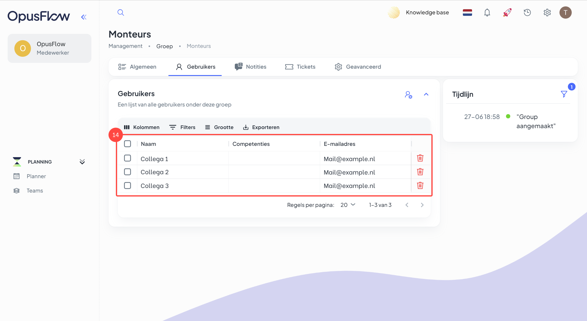

# Werknemers organiseren

### 1. Maak een team aan

<figure><figcaption></figcaption></figure>

Uitleg

1. Ga naar de menubalk, navigeer naar "Planning" ga binnen de module naar "Teams".
2. Hier zie je een lijst van bestaande teams. Op dit moment zijn er nog geen teams aangemaakt.
3. Om een nieuw team aan te maken druk je op "Nieuw".

### 2. Definieer de naam van het team

<figure><figcaption></figcaption></figure>

Uitleg

4. Bepaal de naam van je team.&#x20;
5. Via "Aanmaken" maak het team aan. Het team zal nu in de lijst verschijnen.

### 3. Bekijk je teams in de teamlijst

<figure><figcaption></figcaption></figure>

Uitleg

6. Hier vind je alle teams.
7. Door op het team te drukken kan je deze openen.

### 4. Open het team en bekijk het overzicht

<figure><figcaption></figcaption></figure>

Uitleg

8. Er zijn verschillende tabjes binnen het team die aan dit specifieke team gekoppeld zijn.

### 5. Voeg gebruikers toe aan het team

<figure><figcaption></figcaption></figure>

Uitleg

9. Hier vind je de gebruikers die al aan dit team zijn toegevoegd. op het moment is je team nog leeg, we moeten nog gebruikers aan het team toevoegen.
10. Als je hier drukt dan kan je nieuwe gebruikers toevoegen aan het team.

### 6. Selecteer de juiste gebruikers voor het team

<figure><figcaption></figcaption></figure>

Uitleg

11. Je kan gebruikers direct per naam opzoeken.
12. Door de gebruiker aan te drukken selecteer je deze gebruiker voor het team. Het is mogelijk meerdere gebruikers tegelijk te selecteren en dan in één keer toe te voegen aan het team.
13. Nadat je iedereen hebt geselecteerd druk je op "Opslaan". Zo voeg je de geselecteerde gebruikers toe aan het team.

### 7. Teamleden

<figure><figcaption></figcaption></figure>

Uitleg

14. Nu zie je welke collega's zijn toegevoegd aan dit team.

