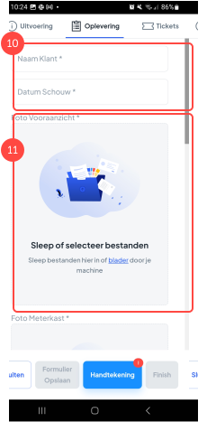
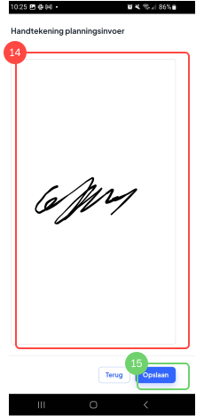
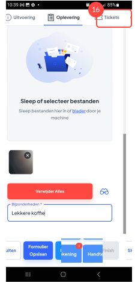

# Schouwformulier invullen via de planningsactiviteit

### 1. Een planningsactiviteit openen

<figure><figcaption></figcaption></figure>

Uitleg

1. Druk op de planningsactiviteit om deze te openen.

### 2. Veiligheidswaarschuwing

<figure><figcaption></figcaption></figure>

Uitleg

Na het openen krijgt iedere betrokkene bij het project de veiligheidswaarschuwingen te zien welke van toepassing zijn op het project, dus ook de schouwer.

2. Hier zie je de algemene informatie over de veiligheidswaarschuwing.
3. Hier zie je de veiligheidswaarschuwing, in dit geval de waarschuwing dat je het paneel op de de juiste manier moet optillen. Vink de waarschuwing aan om aan te geven dat je de waarschuwing gelezen hebt.

### 3. Veiligheidswaarschuwing afronden

<figure><figcaption></figcaption></figure>

Uitleg

4. Vink de waarschuwingen aan.
5. Druk op "Afronden" om de waarschuwing af te ronden.&#x20;

### 4. De activiteit bekijken&#x20;

<figure><figcaption></figcaption></figure>

Uitleg

Om de planningsactiviteit (de schouw) op te leveren ga je naar "Oplevering".

6. Hier zie je de algemene informatie van de activiteit.
7. Hier zie je de klantgegevens.
8. Hier zie je de aan het project gerelateerde plannen en documenten.
9. Druk op "Oplevering" om de schouw op te leveren.

### 5. Het formulier in vullen

<figure><figcaption></figcaption></figure>

Uitleg

Nu je het (schouw)formulier hebt geopend is het tijd om deze in te vullen.

10. &#x20;Hier zie je tekst velden, door op het tekst veld te drukken kun je hierin typen.
11. Door op de afbeelding te drukken kun je afbeeldingen uploaden.&#x20;

### 6. Een afbeelding uploaden

<figure><figcaption></figcaption></figure>

Uitleg

12. &#x20;Maak een keuze of je een foto wilt maken met de camera app of upload een foto uit je fotogalerij.

### 7. Laat het formulier ondertekenen

<figure><figcaption></figcaption></figure>

Uitleg

13. Druk op "Handtekening" om de klant te laten tekenen.

### 8. Handtekening zetten

<figure><figcaption></figcaption></figure>

Uitleg

14. De klant kan in dit veld zijn/haar handtekening zetten.
15. Druk op "Opslaan" om de handtekening op te slaan.

### 9. Open tickets

<figure><figcaption></figcaption></figure>

Uitleg

Naast het formulier invullen kun je ook nog een ticket aanmaken. Met een ticket kun je een taak toewijzen aan iemand anders (of jezelf). Mogelijk kom je tijdens de schouw iets tegen wat een extra actie nodig heeft.

16. Druk op "Tickets".

### 10. Maak een nieuwe Ticket

<figure><figcaption></figcaption></figure>

Uitleg 

17. Druk op "Nieuwe Ticket" om een nieuw ticket te maken.

### 11. Rond de activiteit af

<figure><figcaption></figcaption></figure>

Uitleg

18. Druk op "Finish" om de activiteit af te ronden.

