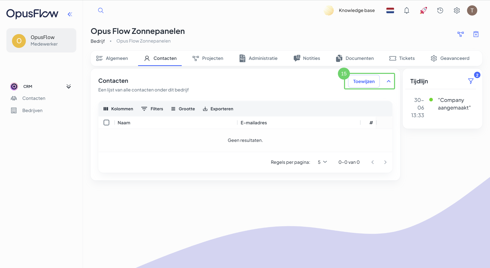

# Een nieuwe klant / project aanmaken (Commercieel)

### 1. Controleer de contactgegevens of maak een nieuw contact aan

<figure><figcaption></figcaption></figure>

Uitleg

1. Om te beginnen is het handig om te controleren of je een contact hebt die je wilt gaan gebruiken in je commerciële project en of dit contact een adres heeft. Ga naar de menubalk, navigeer naar "CRM" en ga naar "Contacten".&#x20;
2. Dit is je contacten lijst, je kunt op de naam drukken om het contact aan te passen of je drukt op de "+ Nieuw" knop recht bovenin om een nieuw contact aan te maken.

### 2. Details en adres controleren

<figure><figcaption></figcaption></figure>

Uitleg

4. Na het openen van de klant krijg je een scherm te zien met de contact gegevens, deze kun je aanpassen door op het potloodje rechts bovenin te drukken.
5. Hier kun je het adres toevoegen van de klant. Op dit moment is dit nog een vereiste, om een offerte te kunnen genereren.

### 3. Contact aan het bedrijf linken

<figure><figcaption></figcaption></figure>

Uitleg

6. Dit is een lijst van alle bedrijven, je kunt hier op de naam drukken om het bedrijf te openen, waar je een project voor wilt gaan aanmaken.
7. Mocht het bedrijf nog niet in je omgeving staan, dan kun je de "+ Nieuw" knop gebruiken om een nieuw bedrijf aan te maken.

### 3.1 Nieuw bedrijf aanmaken

<figure><figcaption></figcaption></figure>

Uitleg

8. Vul hier de bedrijfsgegevens in.
9. Een adres toevoegen is ook hier belangrijk en zelfs verplicht om dit nieuwe bedrijf te kunnen aanmaken.
10. Na het invullen van de verplichte velden, kun je hier het bedrijf "Aanmaken".

### 3.2 Gegevens bedrijf controleren

<figure><figcaption></figcaption></figure>

Uitleg

11. Mocht je geen nieuw bedrijf aanmaken, dan kun je hier de lijst met bestaande bedrijven vinden om dat bedrijf te selecteren, waar jij voor een project wilt aanmaken.
12. Dit zijn alle tabbladen van het geselecteerde bedrijf.
13. Mocht je bedrijf nog geen adres hebben of wil je deze aanpassen dan kun je die hier aanpassen door op het potloodje te drukken.&#x20;
14. Na het controleren van al deze gegevens, gaan we verder met het koppelen van het contact.

### 4. Contact aan het bedrijf koppelen

<figure><figcaption></figcaption></figure>

Uitleg

15. Binnen het bedrijf vind je het tabblad "Contacten". Hier kun je met de "Toewijzen" knop een contact aan dit bedrijf koppelen.

### 4.1 Contact(en) selecteren

<figure><figcaption></figcaption></figure>

Uitleg

16. Met deze zoekbalk kun je zoeken tussen alle contacten die in jou CRM contacten lijst staan.
17. Door op 1 of meerdere van deze contacten te klikken kun je ze selecteren.
18. Na het selecteren van de contacten druk je op "Bijwerken" om op te slaan.

### 5. Project aanmaken

<figure><figcaption></figcaption></figure>

Uitleg

19. Dit is de lijst van alle gekoppelde contacten aan het geselecteerde bedrijf. Controleer of hier minimaal 1 contact in staat.
20. Nu kun je door naar de volgende stap. Ga naar het tabblad "Projecten".

### 5.1 Project gegevens invoeren

<figure><figcaption></figcaption></figure>

Uitleg

21. Selecteer hier het bedrijf waarvoor je dit project wilt maken.
22. Selecteer het contact voor dit project.
23. Druk op "Aanmaken", om het project aan te maken.

### 6. Controleren of het adres is toegevoegd

<figure><figcaption></figcaption></figure>

Uitleg

24. Dit zijn alle tabbladen van dit project.
25. Controleer of je een adres hebt toegevoegd en of dit het juiste adres is. Mocht je deze willen aanpassen, dan kan dit door op het potloodje te drukken.

