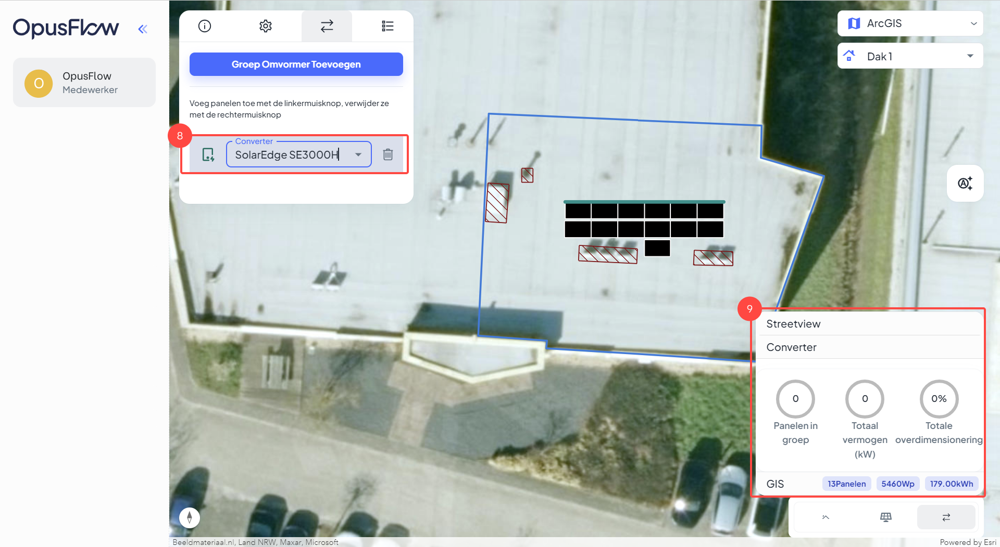
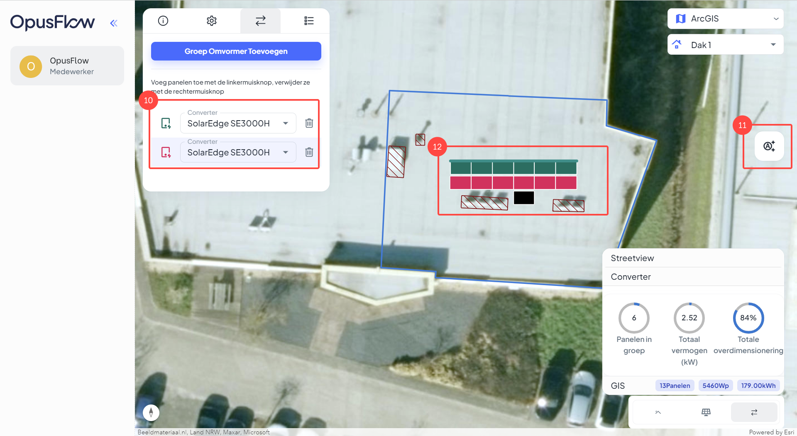

# Een stringplan tekenen

### 1.  Het project openen

<figure><figcaption></figcaption></figure>

Uitleg

1. Ga naar de menubalk, navigeer naar "Projecten" en open "Alles" het overzicht van alle projecten.
2. Open het gewenste project.

### 2. Werkvoorbereiding

<figure><figcaption></figcaption></figure>

Uitleg

3. Ga naar het tabblad "Werkvoorbereiding".&#x20;
4. Druk op "Legplan" om het legplan te openen.

### 3. Ga naar de omvormer stap

<figure><figcaption></figcaption></figure>

Uitleg

5. Hier zie je het dakvlak en de getekende opstelling.
6. Druk op deze knop om naar de omvormerstap te gaan.
7. Druk op "Groep Omvormer Toevoegen" om een nieuw omvormer toe te voegen.

### 4. Selecteer de gewenste omvormer&#x20;

<figure><figcaption></figcaption></figure>

Uitleg

8. Kies hier de gewenste omvormer.
9. Hier zie je de gegevens welke van toepassing zijn op de stringomvormer. Hoeveel zonnepanelen in de string zitten, het totaal vermogen (kW) en de Totale overdimensionering.

### 5. De string tekenen&#x20;

<figure><figcaption></figcaption></figure>

Uitleg

10. Selecteer de omvormer om hier mee te kunnen tekenen. In het voorbeeld is de onderste omvormer geselecteerd.
11. Met deze functie kun je automatisch een stringplan tekenen.
12. Wanneer je de omvormer hebt geselecteerd, kun je beginnen met handmatig tekenen. Dit doe je door de linkermuisknop in gedrukt te houden, beweeg vervolgens over de gewenste zonnepanelen. Om panelen te verwijderen van de string kun je op dezelfde manier doen terwijl je de rechtermuisknop ingedrukt houdt.

### 6. Het legplan updaten met het stringplan.

<figure><figcaption></figcaption></figure>

Uitleg

13. Je hebt het stringplan nu gemaakt. Hier zie je nu ook het ballastplan verschijnen.&#x20;
14. Druk op "Update" om het legplan met het ballast- en stringplan op te slaan.

